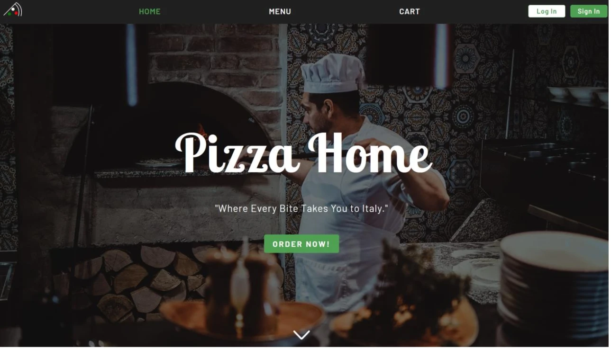
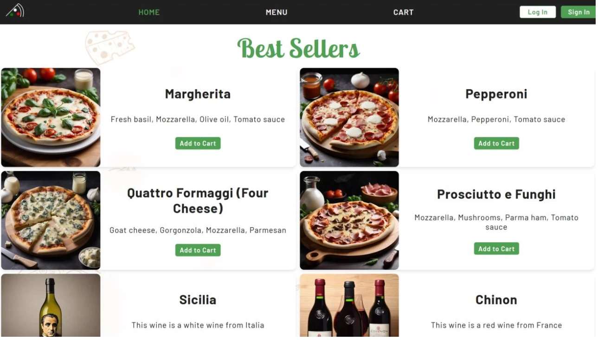
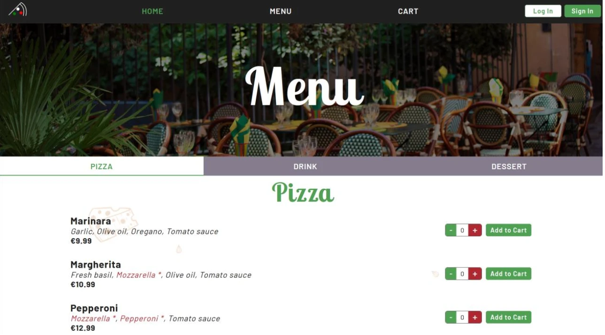
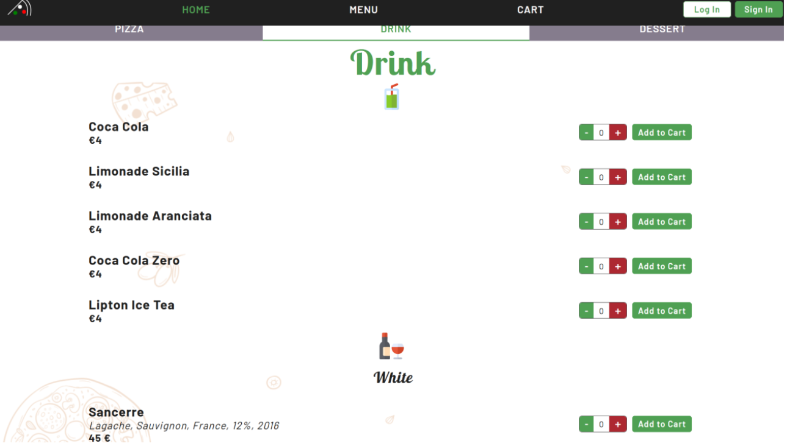
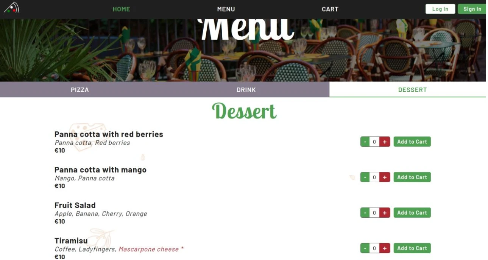

# PizzaHome

[](composer.json)
[](https://github.com/Pierrafrom/PizzeriaDB)
[](src)

The customer-facing ordering website of a 3-app pizzeria system built as a
university group project. Customers order here, kitchen staff process the
order in [PizzaMakerApp](https://github.com/Pierrafrom/PizzaMakerApp), and
[PizzaDeliveryApp](https://github.com/Pierrafrom/PizzaDeliveryApp)
decides who delivers it and by what route. All three share the same
database, [PizzeriaDB](https://github.com/Pierrafrom/PizzeriaDB).

Built with Samuel Boix-Segura.

## Screenshots

| | |
|---|---|
|  |  |
|  |  |
|  | |

## Features

- Browse the menu (pizzas, desserts, wines, sodas, cocktails) and build a
  custom pizza from individual ingredients.
- Cart and checkout, with client accounts (PHP session-based auth) or
  guest checkout.
- An admin dashboard with sales, product, and revenue charts backed
  directly by PizzeriaDB's reporting views, catalogue management
  (add/edit/spotlight/delete items), and stock alerts.

## Architecture

Plain-PHP MVC, no framework:

```text
public/           entry point (index.php), CSS/JS/images
src/
├── controllers/  one controller per page (Home, Menu, Product, Cart,
│                 Checkout, Creation, Registration, Admin, Api)
├── models/       Pizza, PizzaCustom, Dessert, Wine, Soda, Cocktail,
│                 Ingredient (map directly onto PizzeriaDB's tables/views)
├── helpers/      DB access, session handling, URL routing
└── Router.php    front-controller routing
views/            page templates rendered by the controllers
```

## Stack

[](composer.json)
[](composer.json)
[](https://github.com/Pierrafrom/PizzeriaDB)
[](public/js)
[](public/js)

PSR-4 autoloading via Composer, `vlucas/phpdotenv` for config, `filp/whoops`
for dev-time error pages.

## Setup

```bash
composer install
cp config/db_config.example.php config/db_config.php   # fill in DB credentials
cp config/.env.example config/.env                     # set ENVIRONMENT
# load the schema from https://github.com/Pierrafrom/PizzeriaDB first
```

Point your web server's document root at `public/`, or serve it directly
with PHP's built-in server:

```bash
php -S localhost:8000 -t public
```
